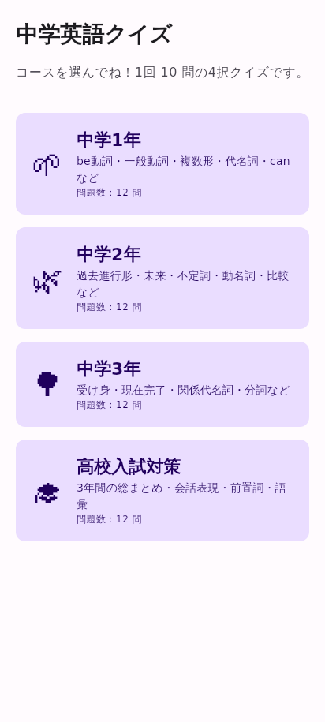
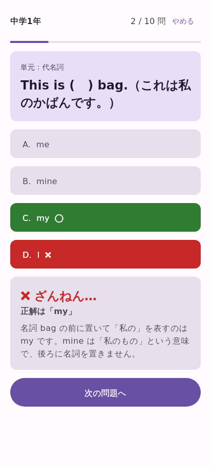
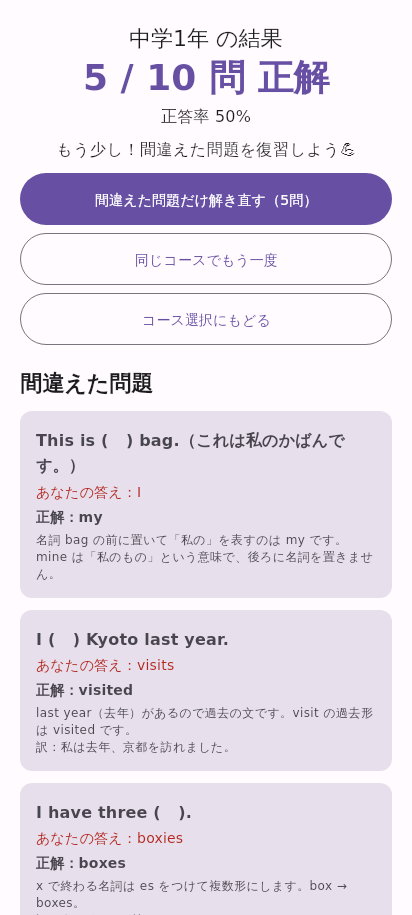

# 中学英語学習アプリ（Android / Kotlin / Jetpack Compose）

中学1〜3年生向けの英語学習アプリです。1ステップずつ機能を足しながら、完成を目指します。

- [1. 完成形の全体設計](#1-完成形の全体設計)
- [2. 開発ロードマップ](#2-開発ロードマップ)
- [3. ステップ1：学年別4択クイズ（貼り付け手順）](#3-ステップ1学年別4択クイズ貼り付け手順)
- [4. うまく動かないとき](#4-うまく動かないとき)

---

## 1. 完成形の全体設計

### 1-1. 画面一覧

| 画面 | 役割 | 実装ステップ |
|---|---|---|
| ユーザー登録 | 初回起動時にユーザー名を入力 | 3 |
| ホーム | 今日の学習量、連続学習日数、ポイント、各機能への入口 | 2 |
| クイズ：コース選択 | 中1／中2／中3／高校入試対策を選ぶ | **1** |
| クイズ：単元選択 | 「be動詞」「現在完了」などの単元を選ぶ | 8 |
| クイズ：問題 | 4択問題、正誤判定、解説 | **1** |
| クイズ：結果 | 正解数、間違えた問題の復習、獲得ポイント | **1**（ポイントは6） |
| 単語帳：一覧 | 学年別の単語リスト。「全部／覚えた／苦手」で絞り込み | 4 |
| 単語帳：カード | 単語カードをめくって覚える。覚えたらチェック | 4 |
| リスニング | 読み上げ（TTS）を聞いて答える | 7 |
| 発音チェック | マイクで発音し、音声認識で正しく言えたか判定 | 7 |
| 学習記録 | 1日ごとの学習量のグラフ、正答率、学年別の進み具合 | 5 |
| ごほうび | ポイント残高、ガチャ、コレクション、バッジ一覧 | 6 |
| 設定 | ユーザー名の変更、読み上げ速度、データのリセット | 3〜 |

### 1-2. 画面遷移

画面下のタブ（ボトムナビゲーション）で、5つの主要画面を切り替えます。

```
[アプリ起動]
    │
    ├─(初回だけ)→ [ユーザー登録] ─→ [ホーム]
    └─(2回目以降)────────────────→ [ホーム]

┌──────────── ボトムナビゲーション（5タブ） ────────────┐
│  🏠ホーム   📝クイズ   📖単語帳   📊記録   🎁ごほうび  │
└────────────────────────────────────────────────────────┘

🏠 ホーム ──→ 各機能へのショートカット / ⚙設定
📝 クイズ ──→ コース選択 → 単元選択 → 問題 ⇄ 解説 → 結果（ポイント獲得）
                                                          └→ 間違えた問題だけ解き直す
📖 単語帳 ──→ 単語一覧（全部／覚えた／苦手）→ 単語カード
                  ├→ 🎧 リスニング
                  └→ 🎤 発音チェック
📊 記録   ──→ 週間グラフ・正答率・連続日数・学年別進捗
🎁 ごほうび → ガチャ → 獲得演出 / コレクション / バッジ一覧
```

### 1-3. アプリの仕組み（アーキテクチャ）

Android の公式推奨である **MVVM**（画面・状態・データを分ける作り方）を使います。

```
 画面（Composable）      … 見た目だけを担当。ボタンが押されたら ViewModel に伝える
      ↑ 状態  ↓ 操作
 ViewModel               … 画面の状態と処理（正誤判定・ポイント計算など）
      ↑        ↓
 Repository              … データの取り出し口（どこに保存されているかを隠す）
      ↑        ↓
 データ保存               … Room（データベース） / DataStore（設定） / JSON（問題データ）
```

### 1-4. 完成時のフォルダ構成（予定）

```
com.example.englishquiz
├── MainActivity.kt
├── data/
│   ├── model/          … Question, Course, Word, StudyRecord, Badge など
│   ├── local/          … Room（データベース）、DataStore（ユーザー名など）
│   └── (repository)    … QuestionRepository, WordRepository, StudyRepository など
├── ui/
│   ├── theme/          … 色・文字（Android Studio が自動作成）
│   ├── navigation/     … 画面遷移、ボトムナビ
│   ├── onboarding/     … ユーザー登録
│   ├── home/
│   ├── quiz/           … ★ステップ1で作る
│   ├── wordbook/
│   ├── speaking/       … リスニング・発音チェック
│   ├── record/         … 学習記録・グラフ
│   ├── reward/         … ポイント・ガチャ・バッジ
│   └── settings/
└── util/               … 読み上げ（TTS）、音声認識のヘルパー
```

### 1-5. 使う技術

| 用途 | 技術 | 導入ステップ |
|---|---|---|
| 画面 | Jetpack Compose + Material 3 | 1 |
| 状態管理 | ViewModel | 1 |
| 画面遷移 | Navigation Compose | 2 |
| ユーザー名・設定の保存 | DataStore | 3 |
| 学習データの保存 | Room（SQLite データベース） | 3〜5 |
| グラフ | Compose の Canvas で自作（ライブラリ不要） | 5 |
| 読み上げ | Android 標準の TextToSpeech | 7 |
| 発音判定 | Android 標準の SpeechRecognizer | 7 |
| 問題データ | assets フォルダの JSON + kotlinx.serialization | 8 |
| （任意）クラウドにログイン・保存 | Firebase Authentication / Firestore | 9 |

> **「ログイン」について**：最初は端末の中にユーザー名と学習データを保存します（ステップ3）。
> 機種変更しても引き継げるクラウドのログインは難しいので、最後に任意で追加します（ステップ9）。

---

## 2. 開発ロードマップ

「前のステップで作ったものを次のステップで使う」順番にしています。
データの保存（ステップ3）を先に作るのは、単語帳・記録・ごほうびの3つがすべて保存機能を使うためです。

| ステップ | 作るもの | 新しく学ぶこと |
|---|---|---|
| **1** ✅ | **学年別4択クイズ**（コース選択 → 問題 → 解説 → 結果 → 間違えた問題の解き直し） | Compose の基本、State、ViewModel |
| 2 | ホーム画面とボトムナビゲーション。クイズを1つのタブにする | Navigation Compose |
| 3 | ユーザー名の登録、データ保存の土台 | DataStore、Room の導入 |
| 4 | 単語帳（一覧、単語カード、覚えたチェック、苦手だけ復習） | Room の読み書き、LazyColumn、絞り込み |
| 5 | 学習記録、進捗メーター（クイズ結果の保存、週間グラフ、連続日数） | Flow、Canvas で図を描く |
| 6 | ポイント、ガチャ、バッジ | ランダム処理、アニメーション |
| 7 | リスニングと発音チェック | TextToSpeech、SpeechRecognizer、マイクの権限 |
| 8 | 問題と単語の大量追加、単元選択 | JSON の読み込み、kotlinx.serialization |
| 9 | 仕上げ（アプリアイコン、ダークモード、テスト、任意でクラウド保存） | Firebase、リリースの手順 |

---

## 3. ステップ1：学年別4択クイズ（貼り付け手順）

### できること
- 「中学1年／中学2年／中学3年／高校入試対策」の4コースから選ぶ（各コース12問）
- 1回10問。問題も選択肢もランダムな順番
- 答えるとすぐに ⭕／❌ と解説が出る
- 結果画面で正答率と間違えた問題の解説を確認できる
- 「間違えた問題だけ解き直す」ボタンで苦手を復習できる

| コース選択 | 問題・解説 | 結果 |
|---|---|---|
|  |  |  |

（パソコン上で描画した画面です。実機では絵文字がカラーで表示され、色は端末の壁紙に合わせて変わります）

### 手順①　新しいプロジェクトを作る

1. Android Studio を起動 → **New Project**
2. **Empty Activity**（Jetpack Compose のアイコンがあるもの）を選んで **Next**
3. 次のとおり入力して **Finish**

   | 項目 | 入力する値 |
   |---|---|
   | Name | `EnglishQuiz` ← **必ずこの名前**（テーマ名が `EnglishQuizTheme` になるため） |
   | Package name | `com.example.englishquiz` |
   | Save location | 好きな場所 |
   | Minimum SDK | `API 26 ("Oreo"; Android 8.0)` |
   | Build configuration language | `Kotlin DSL (build.gradle.kts)` |

4. 右下のバーが止まるまで待ちます（Gradle の準備に数分かかることがあります）。

> ステップ1では `build.gradle.kts` を変更する必要は**ありません**。

### 手順②　フォルダ（パッケージ）を作る

1. 左側のプロジェクト表示の上部を **Android** にします。
2. `app` → `kotlin+java` → `com.example.englishquiz` を右クリック → **New** → **Package**
3. `data.model` と入力して Enter（`data` フォルダの中に `model` フォルダができます）
4. もう一度 `com.example.englishquiz` を右クリック → **New** → **Package** → `ui.quiz` と入力して Enter
   （`ui` フォルダはすでにあるので、その中に `quiz` ができます）

### 手順③　ファイルを作ってコードを貼り付ける

ファイルの作り方：フォルダを右クリック → **New** → **Kotlin Class/File** → 一覧から **File** を選ぶ → 名前を入力して Enter

ファイルを作ったら、中身を **すべて選択（Ctrl+A / Mac は ⌘+A）してから貼り付け** てください。
（自動で入る `package ...` の行も上書きしてOKです。貼り付けるコードに書いてあります）

| # | 作る場所（フォルダ） | ファイル名 | 貼り付けるコード |
|---|---|---|---|
| 1 | `data/model` | `Course` | [Course.kt](app/src/main/java/com/example/englishquiz/data/model/Course.kt) |
| 2 | `data/model` | `Question` | [Question.kt](app/src/main/java/com/example/englishquiz/data/model/Question.kt) |
| 3 | `data` | `QuestionRepository` | [QuestionRepository.kt](app/src/main/java/com/example/englishquiz/data/QuestionRepository.kt) |
| 4 | `ui/quiz` | `QuizViewModel` | [QuizViewModel.kt](app/src/main/java/com/example/englishquiz/ui/quiz/QuizViewModel.kt) |
| 5 | `ui/quiz` | `CourseSelectScreen` | [CourseSelectScreen.kt](app/src/main/java/com/example/englishquiz/ui/quiz/CourseSelectScreen.kt) |
| 6 | `ui/quiz` | `QuizScreen` | [QuizScreen.kt](app/src/main/java/com/example/englishquiz/ui/quiz/QuizScreen.kt) |
| 7 | `ui/quiz` | `ResultScreen` | [ResultScreen.kt](app/src/main/java/com/example/englishquiz/ui/quiz/ResultScreen.kt) |
| 8 | （最初からある） | `MainActivity` | [MainActivity.kt](app/src/main/java/com/example/englishquiz/MainActivity.kt) ← **中身を全部置きかえる** |

> `ui/theme` フォルダの中（`Color.kt`, `Theme.kt`, `Type.kt`）は Android Studio が作ったものを**そのまま使います**。触らないでください。

貼り付け後のフォルダ構成：

```
com.example.englishquiz
├── MainActivity.kt                 ← 置きかえ
├── data
│   ├── QuestionRepository.kt       ← 新規
│   └── model
│       ├── Course.kt               ← 新規
│       └── Question.kt             ← 新規
└── ui
    ├── quiz
    │   ├── CourseSelectScreen.kt   ← 新規
    │   ├── QuizScreen.kt           ← 新規
    │   ├── QuizViewModel.kt        ← 新規
    │   └── ResultScreen.kt         ← 新規
    └── theme                       ← 自動作成のまま
        ├── Color.kt
        ├── Theme.kt
        └── Type.kt
```

### 手順④　実行する

1. 上部メニューの **File** → **Sync Project with Gradle Files**（念のため）
2. 上部ツールバーで実行先を選ぶ
   - エミュレーター：右側の **Device Manager** → **＋** → **Create Virtual Device** → 「Pixel」系を選んで作成
   - 実機：スマホの「開発者向けオプション」で「USB デバッグ」をオンにして USB で接続
3. 緑の **▶（Run 'app'）** を押す

### 各ファイルの役割

| ファイル | 役割 |
|---|---|
| `Course.kt` | コース（中1・中2・中3・入試）の種類 |
| `Question.kt` | 問題1問分のデータの形。選択肢をシャッフルする機能つき |
| `QuestionRepository.kt` | 問題データの置き場所。**問題を増やすときはここに追加** |
| `QuizViewModel.kt` | クイズの頭脳。出題、正誤判定、画面の切り替えを担当 |
| `CourseSelectScreen.kt` | コース選択画面 |
| `QuizScreen.kt` | 問題画面（選択肢、⭕❌、解説、やめる確認） |
| `ResultScreen.kt` | 結果画面（正答率、間違えた問題の一覧、解き直し） |
| `MainActivity.kt` | アプリの入口。ViewModel の状態を見て、3つの画面を切り替える |

### 問題を自分で追加するには

`QuestionRepository.kt` の `listOf(` の中に、次の形で追加します（前の問題の `)` の後ろに `,` を付けるのを忘れずに）。

```kotlin
Question(
    id = 113, course = Course.GRADE1, unit = "疑問詞",
    text = "(   ) do you live? — I live in Tokyo.",
    choices = listOf("What", "Where", "When", "Who"),
    answerIndex = 1, // 正解は 0 から数えて何番目か（この例では "Where"）
    explanation = "場所をたずねるときは Where を使います。"
),
```

---

## 4. うまく動かないとき

| 症状 | 原因と直し方 |
|---|---|
| `EnglishQuizTheme` が赤字になる | プロジェクト名が `EnglishQuiz` ではない。`ui/theme/Theme.kt` を開き、`fun ○○Theme(` の名前を確認して、`MainActivity.kt` の `EnglishQuizTheme` を2か所ともその名前に変える |
| `package` の行や `import com.example.englishquiz...` が赤字になる | パッケージ名が `com.example.englishquiz` ではない。メニュー **Edit → Find → Replace in Files** で `com.example.englishquiz` を自分のパッケージ名に一括置換する |
| `Unresolved reference` がたくさん出る | ファイルを作る場所（フォルダ）が表と違っている。フォルダ構成図と見比べる |
| 何も表示されない、Gradle のエラー | **File → Sync Project with Gradle Files** を実行。それでもだめなら **Build → Clean Project** の後に再実行 |
